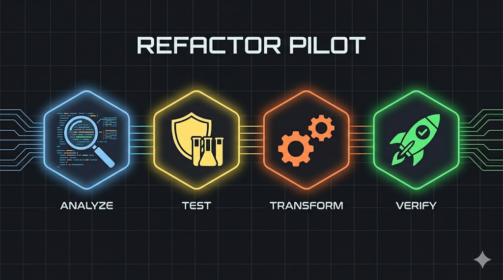

<p align="center">
  
</p>

# Refactor Pilot

**A systematic, AI-assisted framework for safely refactoring legacy codebases.**

Refactor Pilot gives you a repeatable, four-phase process for using large language models (LLMs) to understand, test, transform, and verify code — turning weeks of manual refactoring into hours of guided, AI-accelerated work.

Whether you use Claude, ChatGPT, Copilot, Cursor, or any other AI coding tool, the prompts and scripts in this repo are designed to be **tool-agnostic** and **copy-paste ready**. If you use [Claude Code](https://docs.anthropic.com/en/docs/claude-code), you can drop the included skills directly into your workflow for an even more integrated experience.

---

## Why This Exists

Every codebase has that one corner nobody wants to touch. The authentication module that was "temporary" three years ago. The 2,000-line utility file where six different teams dumped helper functions. The styling layer where every other rule needs `!important` because the cascade became a war zone. Configuration files with flags nobody remembers setting, and entire directories that only one person (who left the company) understood.

Technical debt doesn't happen overnight — it accumulates one shortcut at a time until the cost of changing anything exceeds the cost of just building around it. And now you've got a codebase that works, but nobody can confidently modify it without breaking something unexpected.

AI changes the economics of this problem. What used to require a senior developer spending days carefully tracing dependencies and hand-rewriting modules can now be done in a fraction of the time — but only if you approach it methodically. Pasting your whole codebase into a chat window and asking "fix this" is not a strategy. You need structure: understand first, protect behavior with tests, transform with a plan, then verify everything. That's the process Refactor Pilot gives you.

### What You Get

- A **four-phase methodology** that mirrors how senior engineers refactor, augmented with AI at every step
- **15 ready-to-use prompt templates** for codebase analysis, test generation, refactor planning, and code transformation — including file-type-specific variants for components, configs, utilities, and stylesheets
- **Automation scripts** (Bash) for extracting project metadata, mapping file structures, capturing baselines, and analyzing code — zero dependencies, runs on any Unix system
- **Claude Code skills** with progressive disclosure (quick decision trees + reference docs) for a fully integrated refactoring workflow
- **Strategy guides** for model selection, code anonymization, and creating domain-expert skills
- **Checklists and guardrails** to keep AI-assisted refactoring safe and reviewable

---

## The Four Phases

```
┌─────────────────────────────────────────────────────────────────┐
│                      REFACTOR PILOT                             │
│                                                                 │
│  Pre-work        Phase 1          Phase 2          Phase 3      │
│  ┌──────────┐   ┌──────────┐    ┌──────────┐    ┌──────────┐   │
│  │ DEFINE   │──▶│ GATHER   │───▶│ PREPARE  │───▶│TRANSFORM │   │
│  │REQUIREM. │   │ INSIGHTS │    │ SAFETY   │    │          │   │
│  └──────────┘   └──────────┘    │ NETS     │    └──────────┘   │
│                                 └──────────┘         │          │
│  Goals,          Understand      Tests &         AI rewrites    │
│  constraints,    the codebase    refactor plan   the code       │
│  scope                                               │          │
│                                                      ▼          │
│                                                ┌──────────┐     │
│                                                │ VERIFY   │     │
│                                                │ & DEPLOY │     │
│                                                └──────────┘     │
│                                                Run tests,       │
│                                                benchmark,       │
│                                                ship it          │
└─────────────────────────────────────────────────────────────────┘
```

### Pre-work: Define Requirements

Before analysis begins, establish clear goals, constraints, and success criteria. This prevents scope creep and gives AI concrete targets.

**Prompt:** `prompts/00-define-requirements.md`

### Phase 1: Gather Insights

Before touching a single line of code, understand what you're working with. AI helps you build a mental model of the project in minutes instead of days.

**What happens:**
- Extract project metadata (package.json, dependencies, framework versions)
- Map the file structure by type (components, utilities, configs, tests)
- Run per-file analysis with file-type-specific prompts (components, configs, utilities, styles)
- Analyze code coverage to identify safe vs. risky refactoring targets
- Capture performance baselines for post-refactor comparison
- Check build configuration flags that affect refactoring decisions
- Produce a high-level project summary with architecture diagram

**Output:** A comprehensive codebase profile that serves as context for all subsequent phases.

[Read the full Phase 1 guide →](docs/phase-1-gather-insights.md)

### Phase 2: Prepare & Create Safety Nets

Never refactor without a safety net. AI generates tests that lock down current behavior so you can change the internals with confidence.

**What happens:**
- Generate a test plan covering components, edge cases, and integration points
- AI produces unit and integration tests based on current behavior
- Review and adjust AI-generated tests (don't trust blindly)
- Refine the refactoring scope based on coverage and complexity
- Build a detailed refactor plan with step-by-step changes

**Output:** A test suite protecting current behavior and a concrete refactoring plan.

[Read the full Phase 2 guide →](docs/phase-2-prepare-safety-nets.md)

### Phase 3: Transform

With tests in place and a plan approved, AI rewrites the code. This is where the 90% time savings happen.

**What happens:**
- AI extracts shared utilities and helper functions
- Converts legacy patterns (e.g., class components → hooks, callbacks → async/await)
- Restructures files and modules according to the refactor plan
- Adds inline documentation and type annotations
- Explains its decisions so you can catch misunderstandings early

**Output:** Refactored code with explanatory comments, following the approved plan.

[Read the full Phase 3 guide →](docs/phase-3-transform.md)

### Phase 4: Verify & Deploy

Trust but verify. Run the safety net, benchmark against baselines, and deploy with confidence.

**What happens:**
- Run the full test suite against refactored code
- Compare metrics against captured baselines (bundle size, line counts, code quality indicators)
- Generate a tailored verification checklist
- Recommend a deployment strategy (green light, cautious, or hold)

**Output:** A verification report with benchmark comparison and deployment recommendation.

[Read the full Phase 4 guide →](docs/phase-4-verify-deploy.md)

---

## Repository Structure

```
refactor-pilot-framework/
├── README.md                          # You are here
├── LICENSE                            # MIT License
├── CONTRIBUTING.md                    # How to contribute
├── agents.md                          # Skill registry and installation guide
│
├── docs/                              # Detailed phase guides
│   ├── phase-1-gather-insights.md     # Phase 1 with coverage, baselines, arch diagrams
│   ├── phase-2-prepare-safety-nets.md # Phase 2 with requirements, scope refinement
│   ├── phase-3-transform.md           # Phase 3 with explain-your-decisions pattern
│   ├── phase-4-verify-deploy.md       # Phase 4 verification and deployment
│   ├── best-practices.md              # Safety, anonymization, cost optimization
│   ├── model-selection-strategy.md    # Which AI model for which task
│   ├── anonymization-guide.md         # Working with sensitive/proprietary code
│   └── creating-domain-skills.md      # How to create custom refactoring skills
│
├── prompts/                           # Copy-paste prompt templates
│   ├── 00-define-requirements.md      # Pre-work: define goals and constraints
│   ├── 01-project-metadata.md         # Phase 1: extract tech stack info
│   ├── 01b-coverage-analysis.md       # Phase 1: analyze code coverage reports
│   ├── 02-file-structure-analysis.md  # Phase 1: categorize files by type
│   ├── 03-file-summary.md             # Phase 1: generic per-file analysis
│   ├── 03a-file-summary-component.md  # Phase 1: UI component analysis
│   ├── 03b-file-summary-config.md     # Phase 1: config file analysis
│   ├── 03c-file-summary-utility.md    # Phase 1: utility/helper analysis
│   ├── 03d-file-summary-style.md      # Phase 1: stylesheet analysis
│   ├── 04-project-summary.md          # Phase 1: synthesize all outputs
│   ├── 05-test-plan.md                # Phase 2: generate test scenarios
│   ├── 06-test-generation.md          # Phase 2: generate test code
│   ├── 07-refactor-plan.md            # Phase 2: step-by-step blueprint
│   ├── 08-code-transform.md           # Phase 3: extract, convert, restructure
│   └── 09-verify-checklist.md         # Phase 4: tailored verification checklist
│
├── scripts/                           # Automation scripts (Bash, zero dependencies)
│   ├── analyze-project.sh             # Extract project metadata
│   ├── map-file-structure.sh          # Categorize files by type
│   ├── generate-file-summaries.sh     # Generate per-file analysis prompts
│   └── capture-baselines.sh           # Capture pre-refactoring measurements
│
├── skills/                            # Claude Code skills (progressive disclosure)
│   ├── analyze-codebase/
│   │   ├── SKILL.md                   # Phase 1 skill with decision tree
│   │   └── references/
│   │       ├── file-type-prompts.md   # File-type-specific analysis templates
│   │       └── anonymization.md       # Local model and sanitization strategies
│   ├── generate-tests/
│   │   ├── SKILL.md                   # Phase 2 skill with decision tree
│   │   └── references/
│   │       └── test-patterns.md       # Testing patterns and framework detection
│   ├── refactor-code/
│   │   ├── SKILL.md                   # Phase 3 skill with decision tree
│   │   └── references/
│   │       └── pattern-conversions.md # Legacy → modern pattern guides
│   └── verify-changes/
│       ├── SKILL.md                   # Phase 4 skill with decision tree
│       └── references/
│           └── deployment-strategies.md # Feature flags, canary, blue-green
│
├── examples/                          # Example outputs
│   ├── sample-project-profile.md
│   ├── sample-test-plan.md
│   └── sample-refactor-plan.md
│
└── tests/                             # Test suite for automation scripts
    ├── run-tests.sh                   # 85 assertions across all scripts
    └── fixtures/                      # Test fixtures (Node.js, Python, empty projects)
```

---

## Quick Start

### Option 1: Use the Prompt Templates (Any AI Tool)

1. Clone this repo
2. Open the `prompts/` directory
3. Start with `00-define-requirements.md` to establish your refactoring goals
4. Continue with `01-project-metadata.md` — copy the prompt, paste it into your AI tool along with your project files
5. Work through the prompts sequentially (01 → 09), feeding outputs from earlier steps as context for later ones
6. Use the specialized `03a-03d` prompts for deeper analysis of specific file types

### Option 2: Use the Scripts + Prompts

1. Clone this repo
2. Run the analysis scripts against your project:
   ```bash
   ./scripts/analyze-project.sh /path/to/your/project
   ./scripts/map-file-structure.sh /path/to/your/project
   ./scripts/generate-file-summaries.sh /path/to/your/project
   ./scripts/capture-baselines.sh /path/to/your/project
   ```
3. Feed the script outputs into the prompt templates for deeper analysis

### Option 3: Install Claude Code Skills

**Prerequisites:** [Claude Code](https://docs.anthropic.com/en/docs/claude-code) must be installed on your system.

**Recommended approach — clone the full repo alongside your project:**

```bash
# Clone Refactor Pilot somewhere accessible
git clone https://github.com/GuilhermeVozniak/refactor-pilot-framework.git ~/refactor-pilot-framework

# From your project directory, copy the skills into .claude/skills/
cp -r ~/refactor-pilot-framework/skills/ /path/to/your/project/.claude/skills/

# Also copy the scripts (skills reference them)
cp -r ~/refactor-pilot-framework/scripts/ /path/to/your/project/scripts/
```

**Minimal approach — copy just the skills into your project:**

```bash
# Create the Claude Code skills directory in your project
mkdir -p /path/to/your/project/.claude/skills

# Copy all four skills
cp -r skills/analyze-codebase /path/to/your/project/.claude/skills/
cp -r skills/generate-tests   /path/to/your/project/.claude/skills/
cp -r skills/refactor-code    /path/to/your/project/.claude/skills/
cp -r skills/verify-changes   /path/to/your/project/.claude/skills/
```

**Verify the installation** — your project structure should look like:

```
your-project/
├── .claude/
│   └── skills/
│       ├── analyze-codebase/
│       │   ├── SKILL.md
│       │   └── references/
│       ├── generate-tests/
│       │   ├── SKILL.md
│       │   └── references/
│       ├── refactor-code/
│       │   ├── SKILL.md
│       │   └── references/
│       └── verify-changes/
│           ├── SKILL.md
│           └── references/
├── src/
└── ...
```

Once installed, open Claude Code in your project and trigger skills naturally — say "analyze this codebase" or "generate tests for this module" and Claude will use the corresponding skill.

**Note:** The skills reference automation scripts (`scripts/`) and prompt templates (`prompts/`) from this repo. For the full experience, keep the cloned repo accessible or copy those directories into your project as well.

See [agents.md](agents.md) for the full skill registry, details on each skill, and alternative installation methods.

### Option 4: Use with Cursor, Windsurf, or Other AI Editors

The prompt templates and methodology work with any AI-powered editor:

1. Clone this repo
2. Open the `prompts/` directory as a reference
3. When using your AI editor's chat or inline features, copy the relevant prompt template and paste your code alongside it
4. The `docs/` guides explain the methodology — read them to understand the workflow even if your tool doesn't support skills directly

---

## Best Practices & Safety Guidelines

AI-assisted refactoring is powerful, but it requires discipline. Here are the guardrails:

**Start small.** Begin with internal projects or personal code. Build confidence before touching production systems.

**Never blindly trust AI output.** Always review generated tests, refactored code, and plans. AI is an assistant, not an autopilot.

**Be careful with sensitive code.** Don't paste proprietary algorithms, secrets, or PII into external AI services. Use local models, anonymization techniques, or enterprise-grade tools with data protection guarantees. See the [Anonymization Guide](docs/anonymization-guide.md).

**Match model to task.** Use powerful models for planning (high-leverage decisions) and cheaper models for execution (repetitive tasks). See [Model Selection Strategy](docs/model-selection-strategy.md).

**Inspect diffs carefully.** AI might add unexpected dependencies, change public APIs, or alter behavior in subtle ways. Review every diff line by line.

**Ask AI to explain its decisions.** After each transformation, ask AI to explain its reasoning. This catches misunderstandings before they reach production.

**Validate inputs and outputs.** Before and after refactoring, ensure the module's public interface behaves identically. Property-based testing and snapshot testing help here.

**Use feature flags.** Deploy refactored code behind feature flags so you can roll back instantly if something breaks in production.

**You review, AI authors.** It's fast and tireless, but it needs oversight like any new team member on your project. The quality of its output depends heavily on the quality of your prompts and context.

[Read the full best practices guide →](docs/best-practices.md)

---

## Who Is This For?

- **Developers** drowning in legacy code who want a systematic way to modernize it
- **Tech leads** looking for a repeatable process to reduce technical debt across teams
- **AI enthusiasts** who want to see practical, production-grade uses of LLMs beyond chat
- **Open source contributors** maintaining aging codebases that need modernization

---

## Contributing

Contributions are welcome. Whether it's improving prompts, adding scripts for new languages, creating domain-specific skills, or sharing your refactoring results — open a PR.

See [CONTRIBUTING.md](CONTRIBUTING.md) for guidelines.

---

## License

[MIT](LICENSE) — use it, fork it, build on it.

---

**Built by [@GuilhermeVozniak](https://github.com/GuilhermeVozniak)**
